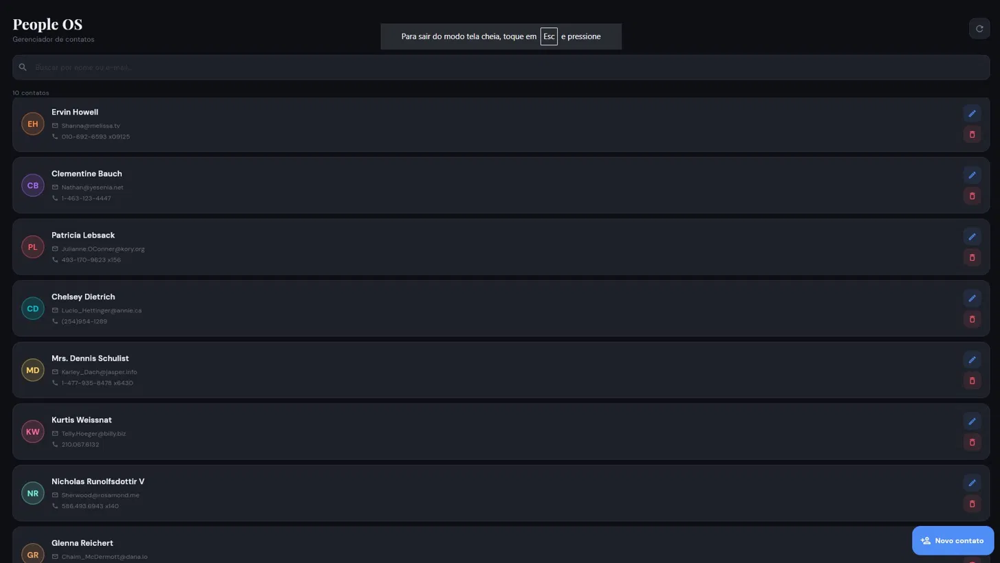
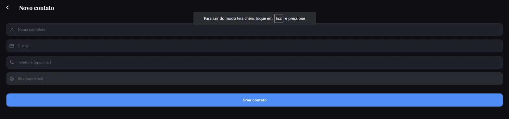
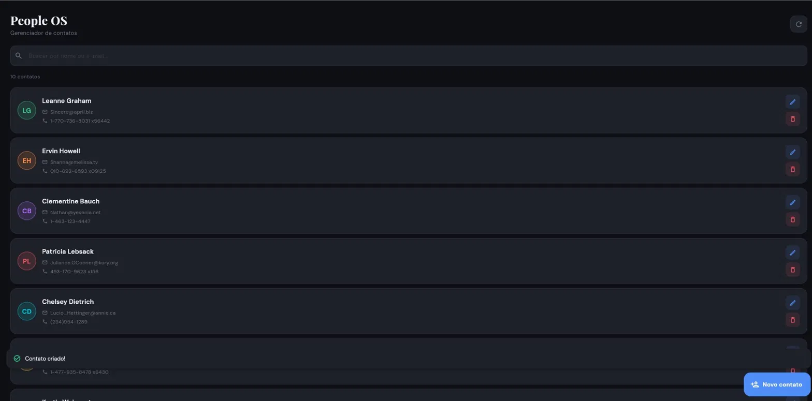
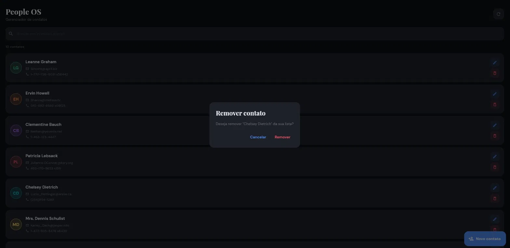

# People OS — Aula 09

App Flutter de gerenciamento de contatos com consumo completo de API REST (GET, POST, PUT, DELETE).

---

## Evidências

### 1. Lista de contatos (GET)
> App carregando os 10 usuários da API via `GET /users`



---

### 2. Tela de cadastro
> Formulário para criar um novo contato com nome, e-mail, telefone e site



---

### 3. SnackBar após criar contato (POST)
> Contato criado com sucesso via `POST /users` — status 201 recebido



---

### 4. Diálogo de confirmação antes de excluir (DELETE)
> `showDialog` exibido antes de executar a exclusão



---

### 5. SnackBar após excluir contato (DELETE)
> Contato removido com sucesso via `DELETE /users/{id}` — item saiu da lista


---

## Estrutura do projeto

```
lib/
├── core/
│   └── tema.dart               # Cores, fontes e estilos globais
├── models/
│   └── usuario.dart            # Modelo com fromJson e toJson
├── screens/
│   ├── home_screen.dart        # Lista, busca, exclusão
│   └── formulario_screen.dart  # Cadastro (POST) e edição (PUT)
├── services/
│   └── api_service.dart        # GET, POST, PUT, DELETE
├── widgets/
│   └── widgets.dart            # Componentes reutilizáveis
└── main.dart
```

---

## Trecho do ApiService

```dart
// POST /users
static Future<Usuario> criarUsuario(Usuario usuario) async {
  final response = await http.post(
    Uri.parse('$_baseUrl/users'),
    headers: {'Content-Type': 'application/json'},
    body: jsonEncode(usuario.toJson()),
  );
  if (response.statusCode == 201) {
    return Usuario.fromJson(jsonDecode(response.body));
  }
  throw Exception('Falha ao criar usuário (${response.statusCode})');
}

// DELETE /users/{id}
static Future<void> deletarUsuario(int id) async {
  final response = await http.delete(Uri.parse('$_baseUrl/users/$id'));
  if (response.statusCode != 200 && response.statusCode != 204) {
    throw Exception('Falha ao deletar usuário (${response.statusCode})');
  }
}
```

---

## Respostas conceituais

### 1. Qual é a diferença entre `POST /users` e `DELETE /users/1`?

`POST /users` envia dados no corpo da requisição para **criar** um novo registro dentro da coleção de usuários. Já `DELETE /users/1` indica qual recurso específico deve ser **removido**, usando o `id` diretamente na URL. O `POST` age sobre a coleção inteira, enquanto o `DELETE` age sobre um item específico.

---

### 2. Por que o `POST` precisa enviar `Content-Type: application/json`?

Esse header avisa ao servidor qual é o formato do corpo da requisição. Sem ele, o servidor não sabe como interpretar os dados recebidos e pode rejeitar a requisição ou processar incorretamente. No Flutter, isso é feito assim:

```dart
headers: {'Content-Type': 'application/json'}
```

---

### 3. O que significa receber status `201`?

O status `201 Created` indica que a requisição foi bem-sucedida e que um novo recurso foi criado no servidor. É diferente do `200 OK`, que significa apenas sucesso genérico. Receber `201` após um `POST` confirma que o objeto foi registrado corretamente na API.

---

### 4. Por que a tela não deveria montar URL e JSON diretamente?

Porque misturar responsabilidades torna o código difícil de manter e de testar. A tela deve cuidar apenas da interface: mostrar dados, capturar input e exibir feedback. Quem conhece a URL da API, os headers e os status codes é o `ApiService`. Se a API mudar (novo endpoint, nova autenticação), basta alterar o service — as telas ficam intactas.

---

### 5. O que muda entre JSONPlaceholder e uma API real com banco de dados?

O JSONPlaceholder é uma API de testes que **simula** as respostas sem persistir nada. Ele responde `201` para um `POST`, mas o usuário criado não existe de verdade — ao recarregar a lista, ele não aparece. Em uma API real, cada operação afeta o banco de dados: o `POST` salva o registro, o `DELETE` o remove permanentemente e o `GET` seguinte já reflete as mudanças. Além disso, APIs reais exigem autenticação, tratamento de erros mais robusto e validações no servidor.

---

## Checklist de entrega

- [x] Lista de usuários com `GET` funcionando
- [x] `toJson` implementado no modelo `Usuario`
- [x] `POST /users` com status `201`
- [x] Tela de cadastro com validação e proteção de clique duplo
- [x] `DELETE /users/{id}` com `id` na URL
- [x] `showDialog` de confirmação antes de excluir
- [x] `SnackBar` em sucesso e erro para criar e excluir
- [x] `PUT /users/{id}` implementado (desafio extra)
- [x] Tratamento de `!mounted` após operações assíncronas
- [x] Camadas separadas: model, service e telas
